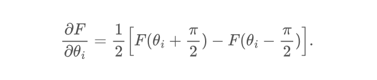

This section I learned how to think circuits as functions.
Encountered with a few built-in circuit templates.
I learnt how to get a gradient of a circuit by using
Parameter Shift Rule

qp.jacobian acts as a wrapper and gives gradient or jacobian.
To use the rule we also need to specify in decorator like 
@qp.qnode(dev, interface="autograd", diff_method="parameter-shift")
To get hessian we apply qp.jacobian twice.
In order to learn minumum expectation value of the circuit.
We use a classical wrapper respect to x where x is 
result of the circuit. Then we feed this classical wrapper to 
optimizier like qp.GradientDescentOptimizer(stepsize = 0.4).

