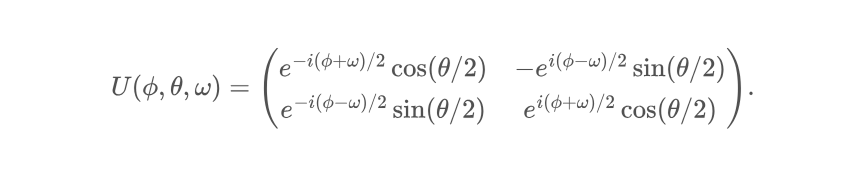

Unitary matrices are matrices that their product with their
adjoint gives Identity. Also, inverse of U and adjoint are 
equal. In 2x2 Unitary matrix, if we want to represent we 
need 8 real numbers, 2 for each complex number. However 
knowing the properties of unitary matrix we can represent
it only with 3 parameters

We can use our Unitary with qp.QubitUnitary(U, wires=wire) 
method.